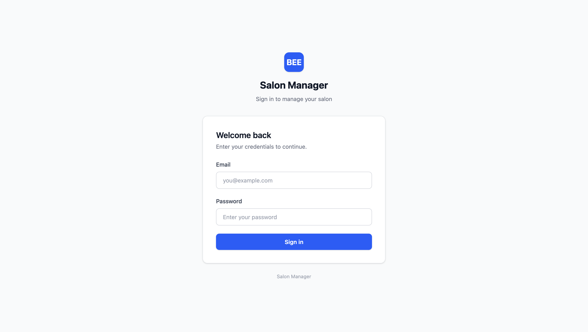
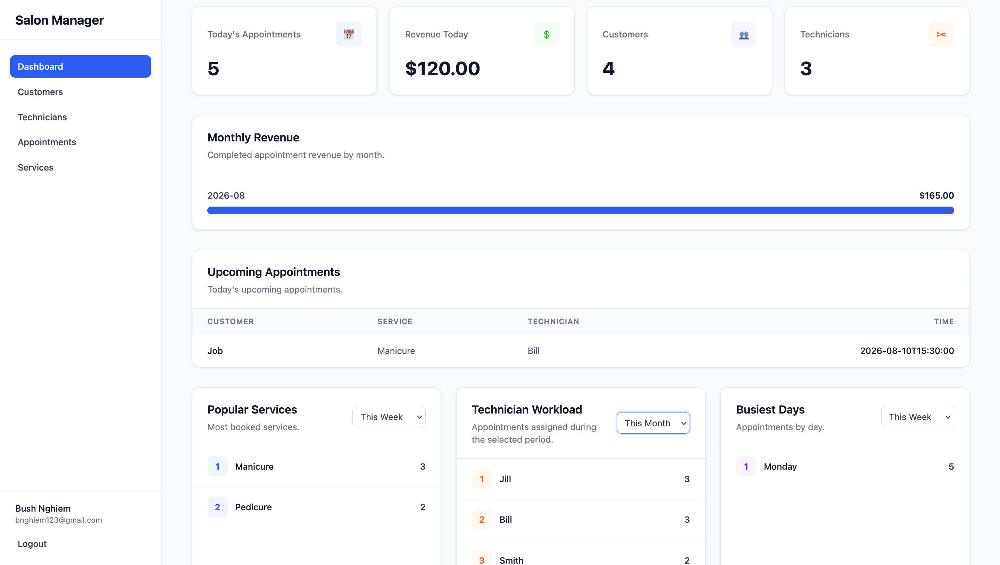
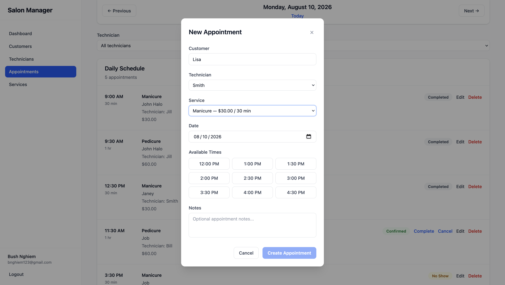

Salon Management System

A full-stack salon management application for managing customers, technicians, services, appointments, users, and business analytics.

The application provides an administrative interface for managing day-to-day salon operations while enforcing appointment scheduling rules such as technician availability, working hours, appointment conflicts, and valid appointment status transitions.

## Screenshots

### Login

### Dashboard

### Appointments

Features

Authentication & Authorization

    JWT-based user authentication
    Password hashing
    Protected API endpoints
    Role-based user management
    Disabled-user handling
    Authenticated frontend routing

Customer Management

    Create, view, update, and delete customers
    Store customer contact information
    View customer appointment relationships

Technician Management

    Create, view, update, and delete technicians
    Configure technician working hours
    Track technician appointments

Service Management

    Create, view, update, and delete salon services
    Configure service duration and pricing
    Store service descriptions

Appointment Management

    Create, update, and delete appointments
    Filter appointments by date, technician, and status
    Generate available appointment time slots
    Validate technician working hours
    Detect scheduling conflicts
    Automatically use service duration and pricing
    Enforce valid appointment status transitions

Dashboard & Analytics

    Today's appointment summary
    Daily revenue
    Customer and technician counts
    Monthly revenue visualization
    Upcoming appointments
    Popular services
    Technician workload
    Busiest days
    Configurable analytics timeframes

Tech Stack
Frontend

    React
    TypeScript
    Tailwind CSS
    React Router

Backend

    Python
    FastAPI
    SQLAlchemy
    Pydantic
    JWT authentication

Database

    SQLite

Getting Started

Prerequisites

Make sure the following are installed:

    Python 3.10+
    Node.js 18+
    npm

Backend Setup

Create a virtual environment in the main Salon Folder:

    python -m venv .venv

Activate the virtual environment.

Windows:

    .venv\Scripts\activate

macOS / Linux:

    source .venv/bin/activate

Navigate to the backend directory:

    cd backend

Install the backend dependencies:

    pip install -r requirements.txt

Start the FastAPI development server:

    uvicorn app.main:app --reload

The backend will be available at:

    http://localhost:8000

FastAPI's interactive API documentation is available at:

    http://localhost:8000/docs

Frontend Setup

Open a new terminal and activate the virtual environment in the main Salon Folder.

Windows:

    .venv\Scripts\activate

macOS / Linux:

    source .venv/bin/activate

Navigate to the frontend directory:

    cd frontend

Install dependencies:

    npm install

Start the development server:

    npm run dev

The frontend will be available at:

    http://localhost:5173
